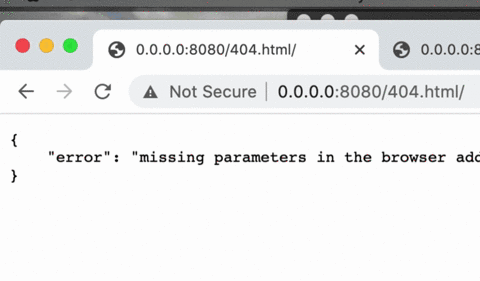

# Фильтр желтушных новостей

Для анализа статей в параметрах строки браузера необходимо указать ссылки на анализируемые материалы через запятую. Но не более количества статей, заданных в переменной окружения,одновременно.



Пока поддерживается только один новостной сайт - [ИНОСМИ.РУ](https://inosmi.ru/). Для него разработан специальный адаптер, умеющий выделять текст статьи на фоне остальной HTML разметки. Для других новостных сайтов потребуются новые адаптеры, все они будут находиться в каталоге `adapters`. Туда же помещен код для сайта ИНОСМИ.РУ: `adapters/inosmi_ru.py`.

В перспективе можно создать универсальный адаптер, подходящий для всех сайтов, но его разработка будет сложной и потребует дополнительных времени и сил.

# Переменные окружения

`MAX_ARTICLES_COUNT` - Максимальное количество анализируемых ссылок на статьи. По умолчанию 10. Задается для защиты от DoS атак.

`MAX_WAITING_TIME` - Максимальное время ожидания ответа сайта и анализа статьи, по истечению которого скрипт заканчивает работу или переходит к следующей ссылке. По умолчанию 3 сек.

# Как установить

Вам понадобится Python версии 3.8 или старше. Для установки пакетов рекомендуется создать виртуальное окружение.

Первым шагом установите пакеты:

```python3
pip install -r requirements.txt
```

Вторым, заполните переменные окружения.

# Как запустить

```python3
python server.py
```

# Как запустить тесты

Для тестирования используется [pytest](https://docs.pytest.org/en/latest/), тестами покрыты фрагменты кода сложные в отладке: urls_handler.py, text_tools.py и адаптеры. Команды для запуска тестов:

```
python -m pytest adapters/inosmi_ru.py
```

```
python -m pytest text_tools.py
```

```
python -m pytest urls_handler.py
```

# Цели проекта

Код написан в учебных целях. Это урок из курса по веб-разработке — [Девман](https://dvmn.org).
